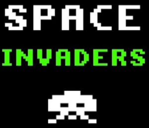

# Space Invaders

JavaFX game project



## Getting Started

```
git clone https://github.com/jiben22/SpaceInvaders
cd SpaceInvaders
mvn install
```

## How to run - **Maven**

`mvn javafx:run`

## How to run - **JavaFX**

Install JavaFX Runtime (12)
https://openjfx.io/openjfx-docs/#install-javafx

*$PATH_TO_FX = /usr/lib/jvm/javafx-sdk-12.0.1/lib/*

```
java --module-path $PATH_TO_FX --add-modules javafx.controls -jar SpaceInvaders-1.0-jar-with-dependencies.jar
```

## Run project with IntelliJ

> Run > Edit Configurations...
VM options: `--module-path $PATH_TO_FX --add-modules javafx.controls`
